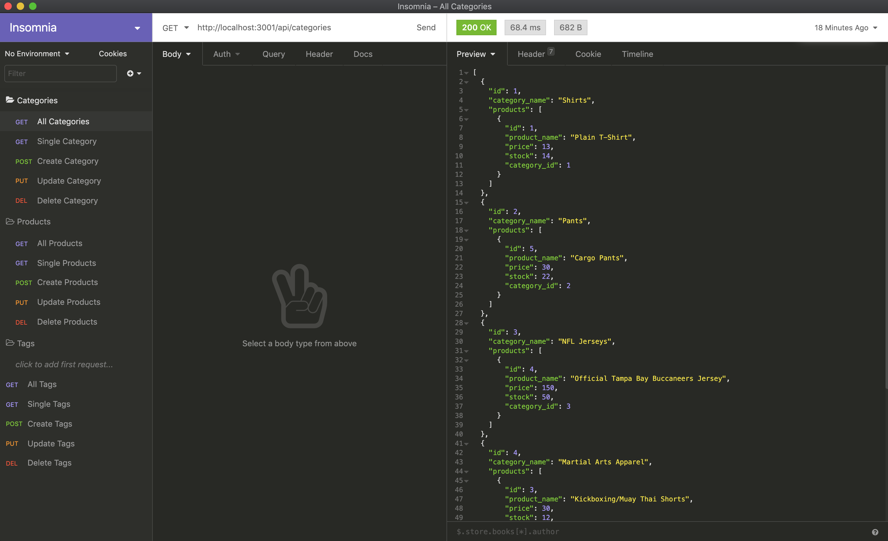

# eCommerce Back End
[](https://opensource.org/licenses/ISC) [](https://github.com/valiantcreative33/ecommerce-back-end/issues) [](https://github.com/valiantcreative33/ecommerce-back-end/graphs/contributors) 

## Description
This eCommerce Back End contains all of the models, routes, and data you will need to quickly launch a small scale eCommerce website - all that is required is front-end code! 

## Table of Contents
* [Installation](#Installation)
* [Usage](#Usage)
* [License](#License)
* [Video Demo](#VideoDemo)
* [Screenshot](#Screenshot)
* [Questions](#Questions)

## Installation
To install, you will need the following npm package dependencies: 
```
npm i init
```
```
npm i mysql2
```
```
npm i express
```
```
npm i sequelize
```
```
npm dotenv
```
Once done so and have cloned or forked from my repo, be sure to source your schema and seeds before launching your server. Then, simply type 'npm start' to begin!

## Usage
Utilizing Sequelize, this application gives a developer the ability to quickly and effectively create common eCommerce data structures, such as categories, products, and product tags. With ORM and Sequelize, all of this can be accomplished with common Javscript and is easily iterable to scale quickly.

## License
This application is under the [MIT](https://opensource.org/licenses/ISC) license.

## Video Demo
A video demonstration of the application can be found on [YouTube](https://youtu.be/y5enAIfIrh0).

## Screenshot


## Questions
You can find me on [Github](https://github.com/valiantcreative33), if you have any questions.
If you have additional questions, you can also find me on [LinkedIn](https://www.linkedin.com/in/valiantcreative/), or via email at ruben@valiantcreative.net.